<h1 align="center">:name_badge:Amigo Secreto:name_badge:</h1>

# :card_index: Indice
* [Descripción del Proyecto](#pencil-descripción-del-proyecto)
* [Funcionalidad del Proyecto](#white_check_mark-funcionalidad-del-proyecto)
* [Acceso del Proyecto](#open_file_folder-acceso-al-proyecto)
* [Apoyos y Herramientas](#apoyos-y-herrramientas)
* [Diagrama de Flujo](#trident-diagrama-de-flujo)
* [Desarrollador](#hammer-desarrollador-construction_worker)

# :pencil: Descripción del Proyecto

El proyecto es el 1er Challenge en el programa ONE en Alura Latam para el grupo G8, una parte del código de HTML y CSS proporcionada por ellos.

El objetivo del proyecto consiste en agregar nombres, recopilarlos y seleccionar al azar el nombre de quien será el "amigo secreto".

# :white_check_mark: Funcionalidad del Proyecto

# :open_file_folder: Acceso al proyecto
- Para interactuar en la página, puede entrar al siguiente link:
    
    ``

- Para bajar el proyecto debe ingeresar el siguiente comando:

     `$ git clone https://github.com/AdooRB/amigo-secreto.git`

# :facepunch: Apoyo

&nbsp El equipo de Alura Latam proporcionaron la estructura del código HTML y CSS 
 &nbsp para el proyecto.

# :trident: Diagrama de Flujo

```mermaid
flowchart TD

    ini((INICIO))
    addFr@{ shape: trap-t, label: "Añadir Amigo 
    (botón)"}
    P_nom{"¿Agregó un nombre
     en 'input'?"}
    grArr[Guarda el nombre en Array ListaDeNombres]
    clInt@{ shape: rect, label: 'Limpia la etiqueta HTML "Input"' }
    alrUsr@{ shape: rounded, label: 'Notifica: "Por favor, inserte un nombre"' }
    clUl@{ shape: rect, label: 'Limpia la etiqueta HTML "Lista no ordenada" id:listaAmigos' }
    addLi@{ shape: rect, label: 'Agrega elemento HTML "li" a cada nombre de Array listaDeNombres'}
    shwLis@{ shape: curv-trap, label: 'Muestra la lista en la etiqueta HTML "lista no ordenada" - id: listaAmigos'}
    sortFr@{ shape: trap-t, label: "Sortear Amigo 
    (Botón)" }
    P_listEx{¿Está vacío el Array listaDeNombres?}
    calNumInd@{ shape: rect, label: 'Cálcula un número a la azar para elegir un nombre'}
    shwNom@{ shape: curv-trap, label: 'Muestra el nombre sorteado en la etiqueta HTML "lista no ordenada"  id:resultado'}
    fin((FIN))
    intrNom@{ shape: manual-input, label: 'Introduce un nombre'}


    ini-.->intrNom;
    ini -.->sortFr;
    intrNom-->addFr;
    alrUsr-->intrNom;
    
    subgraph Botón_Añadir_Amigo
    addFr-->|onClick|P_nom;
    P_nom-->|no|alrUsr;
    P_nom-->|si|grArr;
    grArr-->clInt;
    clInt-->clUl;
    clUl-->addLi;
    addLi-->shwLis;
    end

    subgraph Botón_Sortear_Amigo
    shwLis-.->sortFr;
    sortFr-->|onClick|P_listEx;
    P_listEx-->|no|calNumInd;
    calNumInd-->shwNom;
    end

    
    P_listEx-->|si|fin;
    shwNom-->fin;
    sortFr-->|not Click|fin;
    addFr-->|not Click|fin;

    style Botón_Sortear_Amigo fill:#472214,stroke:#333,stroke-width:4px
    style Botón_Añadir_Amigo fill:#7d7d7d ,stroke:#333,stroke-width:4px


```

# :hammer: Desarrollador :construction_worker:

|[ Aldo Flores](https://github.com/AdooRB)|
| :---: |
